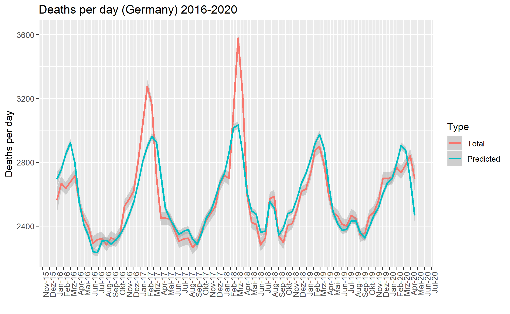
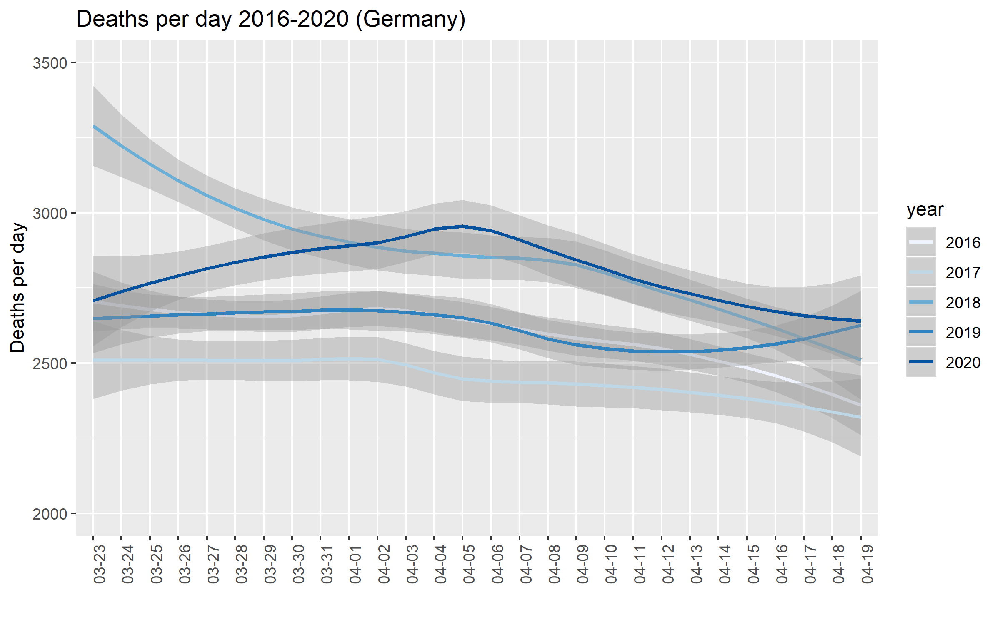
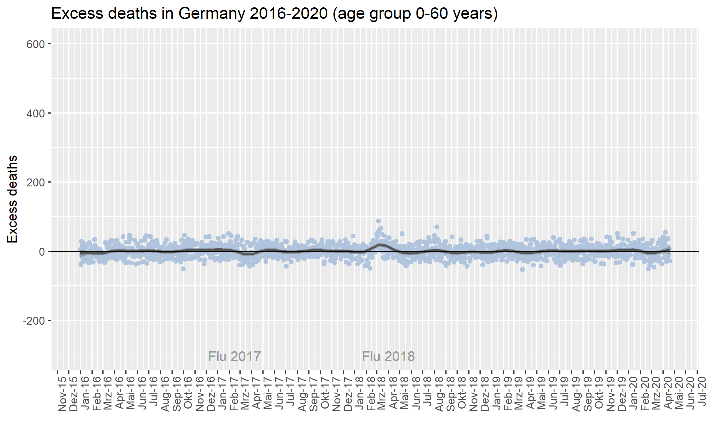
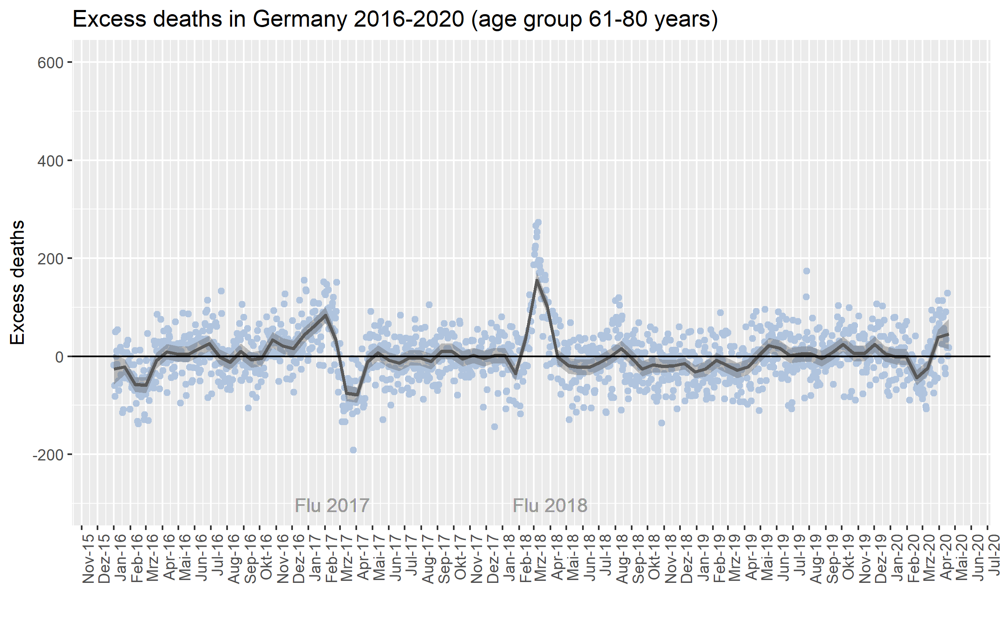
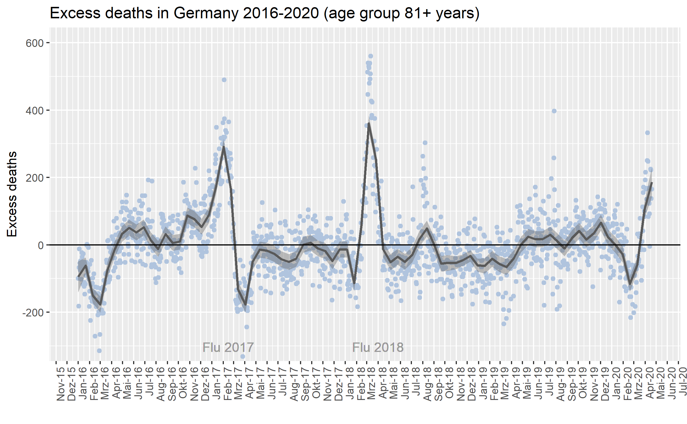

 # COVID-19: Excess Mortality in Germany

*Last update: 20 May 2020*

**Abstract:**

This article investigates excess mortality in Germany (Übersterblichkeit) from 2016 to April 2020 and in particular possible excess mortality during the Covid-19 outbreak (23 March 2020 to 19 April 2020 considered). 

The results suggest that there is little to no excess mortality *beyond* the [officially reported Covid-19 deaths](https://www.rki.de/DE/Content/InfAZ/N/Neuartiges_Coronavirus/Fallzahlen.html), which indicates that official figures are relatively accurate and that there are no "hidden" deaths due to Covid-19. 

- The estimated number of excess deaths in the considered period ranges between 0 and 170 deaths, with an expected values of 93 (OLS model). 
- 74% of excess deaths are attributable to the age group 81+ years. 
- 23% of excess deaths are attributable to the age group of 61-80 years. 
- There is no evidence for excess mortality in the age group 0-60 years.

**1. Introduction**

Excess mortality is a temporary increase of mortality (the number of deaths) compared to a (seasonal) baseline. There is evidence, that Covid-19 has led to a significant increase in the number of deaths in countries such as Portugal, England and Wales, France, the Netherlands, and Italy  (["How deadly is COVID-19? A rigorous analysis of excess mortality and age-dependent fatality rates in
Italy"](https://www.medrxiv.org/content/10.1101/2020.04.15.20067074v3.full.pdf) /  ["Excess mortality during COVID-19 in
five European countries and a critique of mortality data analysis"](https://www.medrxiv.org/content/10.1101/2020.04.15.20067074v3.full.pdf)).

The German Robert-Koch-Institut (RKI) has reported correlation of some excess mortality in Germany with Covid-19 (["Täglicher Lagebericht des RKI zur Coronavirus-Krankheit-2019 (COVID-19) 24.04.2020"](https://www.rki.de/DE/Content/InfAZ/N/Neuartiges_Coronavirus/Situationsberichte/2020-04-24-de.pdf?__blob=publicationFile)). However, there seems to be no rigorous assessment so far. 

I investigate excess mortality in Germany based on a simple statistical model which contols for seasonality and temperature.

**2. Data and Methodology**

Data on the number of deaths in Germany are usually published with some delay by the [German Statistical Office (Destatis)](https://www.destatis.de/EN/Home/_node.html). Data on a broader scale is available through [EUROMOMO](https://www.euromomo.eu/). Because of Covid-19, preliminary data on deaths per day by age group has been published by Destatis in May 2020. I use [the preliminary data published by Destatis](https://www.destatis.de/DE/Themen/Gesellschaft-Umwelt/Bevoelkerung/Sterbefaelle-Lebenserwartung/Tabellen/sonderauswertung-sterbefaelle.html) as well as data on reported Covid-19 deaths published by [RKI](https://www.arcgis.com/home/item.html?id=f10774f1c63e40168479a1feb6c7ca74), to investigate excess mortality in Germany.

- Find the data [here](https://github.com/Bixi81/COVID-19_excess_deaths/blob/master/deaths_germany.csv).
- Find the model (R script) [here](https://github.com/Bixi81/COVID-19_excess_deaths/blob/master/covid19_excess_mortality.R).

I use a generalised additive model (GAM) with splines to estimate the a mortality baseline contingent on the year (reference: 2016), the week of the year (reference: week 25), and the max. temperature in Frankfurt am Main as a proxy for overall weather conditions in Germany. Daily data is used to estimate the mortality baseline. The actual number of deaths per day is contrasted to the mortality baseline - as predicted by the GAM model - in order to plot excess mortality. In the model, there is no differentiation of the pre and post Covid-19 period in order to contrast actual mortality figures against a "no Covid-19" baseline.

In a second step, a simple OLS model is used to get an estimate of excess deaths during Covid-19 (defined 23 March 2020 until 19 April 2020; data is available until 19 April only) by adding an indicator for the resprctive period. Otherwise the same explanatory variables are used as in the GAM model (described above). See the [R script](https://github.com/Bixi81/COVID-19_excess_deaths/blob/master/covid19_excess_mortality.R) for details.

The figure below shows the (smoothed) numer of actual deaths since 2016 as well as the predicted numer of deaths (GAM model). There clearly is seasonality of mortality, which tends to be higher during the winter month and during very hot periods in the summer 2018/2019.

The number of actual deaths between 23 March and 19 April is plotted for each year in the figure below. The figure indicates that the number of deaths has been relatively high in 2020 - in particular in early April - compared to 2016, 2017, and 2019 but the number of deaths is not statistically different when compared to 2018. The flu season 2017/2018 has been the most severe in 30 years and had led to an [estimated 25000 excess deaths](https://www.aerzteblatt.de/nachrichten/106375/Grippewelle-war-toedlichste-in-30-Jahren).

**3. Results**

**3.1 Overall Results**

The [OLS regression results](https://github.com/Bixi81/Covid-19_excess_deaths/blob/master/regression_results.txt) indicate that - over all age groups - the daily excess mortality in Germany between 23 March 2020 and 19 April 2020 was about 320 deaths per day with a 95% confidence interval of 243 to 397. The point estimate from the more flexible GAM model is 182 excess deaths per day (with a mean absolute error of 115) in the respective period. The GAM is especially tuned to account for max. temperatures in order to capture the effects of high mortality in times of unusually high temperatures, i.e. in summer 2018 and 2019. The relatively low point estimate from the GAM model likely is a result of temperatures above the seasonal average in March and April 2020 and may provide a lower bound estimate.

Between 23 March and 19 April, a total of 6360 deaths due to Covid-19 (an average of 227 per day) have been reported in Germany according to RKI data. The daily average of reported deaths due to Covid-19 is slightly below the estimated excess mortality based on the OLS model and slightly above the estimated excess mortality as predicted by the GAM model. 

- Based on the **OLS model**, the excess mortality *beyond* the officially reported Covid-19 deaths ranges between 16 and 170 deaths, with an expected value 93 deaths. 
- Based on the **GAM model**, the excess mortality *beyond* the officially reported Covid-19 deaths ranges between 0 and 70 deaths, with an expected value of 0. 

**3.2 Results by Age Groups**

Reported deaths which are [attributed to Covid-19](https://github.com/Bixi81/COVID-19) occur mostly in the age group 80+ years (64%) and 60-79 (32%), according to RKI data. The mortality data provided by Destatis is in line with these figures as the results of [OLS regressions by age group (Columns 2-4)](https://github.com/Bixi81/Covid-19_excess_deaths/blob/master/regression_results.txt) suggest. 

*Note that the data from Destatis allows no accurate identification of age groups since age groups labels overlap (e.g. 75-80 and 80-85). It is assumed that each age group includes the highes number of years (and excludes the lowest).*

- In the **age group 0-60**, no excess mortality can be found. The estimated coefficient is not statistically different from zero with an expected value of 9 deaths per day (or about 3% of excess deaths).

- In the **age group 61-80**, the expected value is 75 (excess deaths in the period between 23 March and 19 April 2020, about 23% of estimated excess deaths).

- In the **age group81+**, the expected value is 237 (excess deaths in the period between 23 March and 19 April 2020, about 74% of excess deaths).

The figures below show the estimated excess mortality by age group since 2016. Excess mortality is particularly pronounced in the age group 80+ compared to the remaining groups.

**4. Conclusion**
